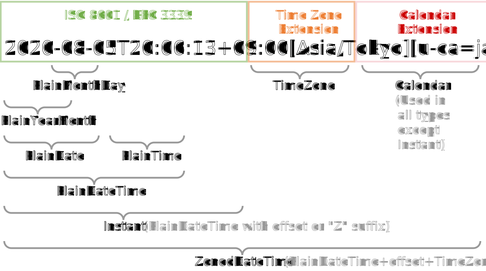

<!-- .slide: data-cover -->

# How to outsmart time 🧠🕒 <!-- .element: class="r-fit-text" -->
## Building futuristic JavaScript applications using Temporal <!-- .element: class="r-fit-text" -->
Ujjwal Sharma (@ryzokuken), WD Code 🇦🇺

---
<!-- .slide: class="igalia-align-left igalia-text-medium" -->

# Recap 🔙

* `Date` severely outdated, has serious issues.
* Popular third party libraries for date/time handling.
* Quite a few problems exist, need to do something.
* Temporal: state-of-the-art date/time handling in JS.
* Ergonomic API with special focus on common use-cases.
* Powerful feature set accommodating complex use-cases.
	* Local Calendar Support
	* Custom Time Zones and Calendars

----

<iframe width="800" height="450" src="https://www.youtube.com/embed/3F2A708c1o0" title="YouTube video player" frameborder="0" allow="accelerometer; autoplay; clipboard-write; encrypted-media; gyroscope; picture-in-picture" allowfullscreen></iframe>

---
<!-- .slide: data-section-cover -->

Temporal is now Stage 3! 🎉 <!-- .element: class="r-fit-text" -->

----
<!-- .slide: class="igalia-align-left" -->

# What does that mean? 🤔 <!-- .element: class="r-fit-text" -->

* All the tiny details have been discussed.
* The specification text has been approved.
* The committee is satisfied with the design.
* Time to start implementing and using Temporal.
* Polyfill implementations.
* Browser implementations.

----
<!-- .slide: data-visibility="hidden" -->

TC39 Stage Process

----
<!-- .slide: data-visibility="hidden" -->

What changed?

----


----
<!-- .slide: class="igalia-align-left igalia-text-medium" -->

# Summary

* `Instant` represents an absolute time.
* `Plain*` types deal with regular wall-clock time and calendar date.
* `Calendar`s refer to a human calendar.
* `TimeZone`s refer to an offset or a human time zone.
* `ZonedDateTime` is the combination of an Instant and a `TimeZone`.
* All arithmetic operations are done using `Duration`s.

----
<!-- .slide: class="igalia-align-left" data-visibility="hidden" -->

# Summary

* `Instant` and `Plain*` types work as previously talked about.
* `ZonedDateTime` is the combination of an Instant and a `TimeZone`.
* All arithmetic operations are done using `Duration`s.
* `TimeZone`s are used in ZDT primarily, direct conversion removed.
* `Calendar`s are used for `Date` and friends.
* Use month codes instead of indexes.
* All other features could be added in a v2 proposal.

---
<!-- .slide: class="igalia-align-left" -->

# Serialization Format 📜 <!-- .element: class="r-fit-text" -->

* ISO8601/RFC3339 old and limited.
* Ad-hoc formats with additional time zone.
* Need to also add calendar into the mix.
* The need for a standardized, generalized extension format.
* `draft-ryzokuken-datetime-extended`
* Working through the standards process.

----



---
<!-- .slide: data-section-cover -->

# Let’s make an invoice calculator! 🖩

----
<!-- .slide: class="igalia-align-left" -->

# Step 1: Pick a date-time picker 📆 <!-- .element: class="r-fit-text" -->

* Pick a date-time picker component that fits rendering strategy.
* Should return an ISO-8601 string.
	* Should return a Temporal type?
* There are already many you can pick from!
	* `react-picker` (React)
	* `datetimepicker` (jQuery)

----

`Temporal.PlainDateTime.from(myString)` <!-- .element: class="r-fit-text" -->

----
<!-- .slide: class="igalia-align-left" -->

# Step 3: Two date-times? Find the difference! <!-- .element: class="r-fit-text" -->

* When you have a start point and an end point, you can find the difference.
* Durations can be both positive and negative, direction is important!
	* Note when adding durations especially.
	* Also especially when dealing with money!
* You can check the sign with `duration.sign`.
* You can find the absolute value by `duration.abs()`.

----

```javascript [1-2|4-6|8-10]
const earlier = Temporal.PlainDateTime.from('2020-01-09T00:00');
const later = Temporal.PlainDateTime.from('2020-01-09T04:00');

const result = later.since(earlier, {
  largestUnit: 'hours'
}); // 'PT4H'

const result2 = earlier.until(later, {
  largestUnit: 'minutes'
}); // 'PT240M'
```

----
<!-- .slide: class="igalia-align-left igalia-text-medium" -->

# Step 4: Find out how much you worked! <!-- .element: class="r-fit-text" -->

* Once you have an array of durations, you can add all of them together.
* <pre><code data-trim style="padding: 0" class="javascript">
durations.reduce(
    (total, current) => total.add(current),
    new Temporal.Duration()
);
</code></pre>
* <pre><code data-trim style="padding: 0" class="javascript">
const total = Temporal.Duration.from(‘PT0S’);
durations.forEach(duration => total.add(duration));
</code></pre>
* Remember to call `abs()` if you need to!

----
<!-- .slide: class="igalia-align-left" -->

# Duration Serialization Format 📜 <!-- .element: class="r-fit-text" -->

* <pre><code data-trim style="padding: 0" class="javascript">
Temporal.Duration.from({
    years: 1, months: 2, weeks: 3, days: 4,
    hours: 5, minutes: 6, seconds: 7})
.toString(); // 'P1Y2M3W4DT5H6M7S'
</code></pre>
* Can use fractions! (careful)

----
<!-- .slide: class="igalia-align-left" -->

# Step 5a: 💸 by the hour <!-- .element: class="r-fit-text" -->

* Depending on the contract, you might want to charge per day or per hour.
* The math is easy! In fact, it’s built into Temporal.
* For bringing things to a single unit, just use `total(...)`.

----

```javascript
// How many 24-hour days is 1,000,000 seconds?
d = Temporal.Duration.from(‘PT1000000S’);
d.total({ unit: ‘hours’ }); // 277.77777777777777
```

----

# Step 5b: Relativity is important! 🔎 <!-- .element: class="r-fit-text" -->

----

```javascript [2|3-6|7-10]
// Find totals in months, w/o taking DST into account
d = Temporal.Duration.from({ hours: 2756 });
d.total({
   relativeTo: '2020-01-01T00:00+01:00[Europe/Rome]',
   unit: 'months'
}); // => 3.7958333333333334
d.total({
  unit: 'months',
  relativeTo: '2020-01-01'
}); // => 3.7944444444444443
```

----
<!-- .slide: class="igalia-align-left" -->

# Step 5c: Rounding for the win! 🏆 <!-- .element: class="r-fit-text" -->

* The final value can be rounded up or down, depending on the contract.
* Sometimes you don’t charge by a “X”, but rather “n Xs”.
* `round(...)` to the rescue!

----

```javascript
d = Temporal.Duration.from({ minutes: 6 });
d.round({
  smallestUnit: 'minutes',
  roundingIncrement: 5,
  roundingMode: 'ceil' }); // => PT10M
```

---
<!-- .slide: data-section-cover -->

# Assignment Time 📋

[](https://codesandbox.io/embed/temporal-playhouse-55yg9)

----
<!-- .slide: class="igalia-align-left" -->

# Links to the future (and present) 🔗 <!-- .element: class="r-fit-text" -->

* [ Polyfill ](https://www.npmjs.com/package/proposal-temporal)
* [ V8 tracking issue ](https://bugs.chromium.org/p/v8/issues/detail?id=11544)
* [ SpiderMonkey tracking issue ](https://bugzilla.mozilla.org/show_bug.cgi?id=1519167)
* [ JavaScriptCore tracking issue ](https://bugs.webkit.org/show_bug.cgi?id=223166)
<!-- * [ core-js tracking issue ](https://github.com/zloirock/core-js/issues/365) -->
* [ Temporal v2 ](https://github.com/js-temporal/proposal-temporal-v2)

---
<!-- .slide: class="igalia-align-left" -->

# Special Thanks 🙏

* Temporal Champions
* Moment.js Maintainers
<!-- * Temporal Stage 3 Reviewers -->
<!-- * ECMA 262 Editors -->
* Organizers and PC
* Olga Kobets

----

# Ta! ❤🕒
