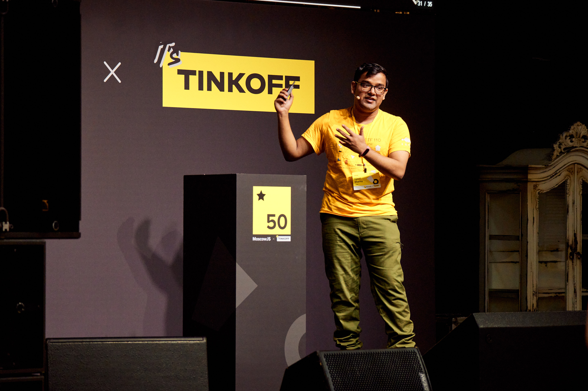

## My dev environment is the GOAT 🐐

### Ujjwal "Ryzokuken" Sharma
### Compilers Codecamp

---

## Hello, there! 👋

---

## I have a text editor, now what?

* Text editors are great, but writing code is a bit more complicated than just that.
* A bunch of additional features make life easier though.
    * Autocomplete
    * Linting
    * Go to definition
    * Find references
    * Documentation on hover
* IDEs? 👀

---

## Language servers to the rescue! 🚒

* One IDE per lanugage/stack? (👀 JetBrains)
* One editor to rule them all?
* The need for a more modular solution.
* Standalone language servers.
* Language Server Protocol.

---

## Language servers to the rescue! 🚒

---

## LSP for my favorite editor 📄

---

## LSP for my favorite editor 📄

* Vim has a plugin for LSP, called `vim-lsp`.
* NeoVim has LSP support inbuilt.
* If you use non-default plugins, they may support LSP too:
    * Completion (YCM/Deoplete/CoC)
    * Linting and Fixing (Ale)
    * Viewing and Finding Tags (Vista/Tagbar)

---

## So, which servers do you use?

* C/C++ - `clangd`, `cpplint`
* Rust - `rust-analyzer`, `clippy`
* JavaScript - `tsserver`, `prettier`
* Python - `pyright`, `flake8`
* Ruby - `solargraph`

---

# Thanks! 🙏

---

# Questions? ❓