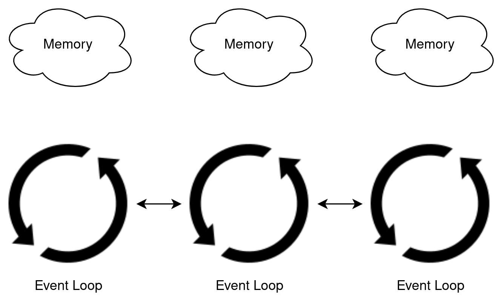
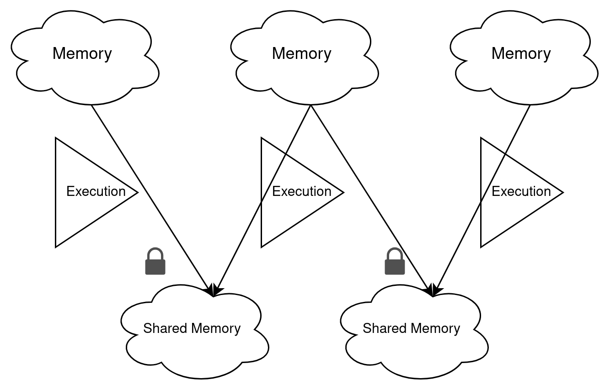
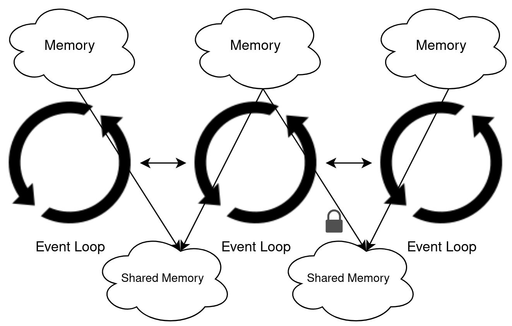

## Multicore JS 🚀

### Past, Present and Future

### Ujjwal Sharma (@ryzokuken)

#### HolyJS Moscow 2021 🇷🇺

---

## About Me 👦

<div class="columns" style="grid-template-columns: 1fr 2fr">


-   Ujjwal "Ryzokuken" Sharma
-   Compilers Hacker at Igalia
-   TC39 Delegate
-   ECMA-402 Editor
-   Node.js Core Collaborator
-   V8 Contributor
-   International Speaker

</div>

---

## About Igalia 💼

-   Software Consultancy
-   HQ in Galicia, Spain 🇪🇸
-   Free Software
-   TC39, W3C
-   Web Browsers 🌐
-   Compilers
-   Web Standards 📚

---

### Igalia 💖 Bloomberg 💖 Google

---

## Why multicore JS? 👨‍💻

-   CPU hardware is scaling with multi-core, big/little rather than frequency
-   The client side is moving to the Web
-   JS and Wasm are taking over servers too!
    -   e.g., Fastly's and CloudFlare's models
-   Important to expose hardware capabilities to software

---

## Old news ⏳

-   High-level async constructs (allows work in the background)
-   Workers (and SharedWorkers, ServiceWorker, AudioWorklet, etc)
-   `postMessage`
-   MessageChannel
-   `async`/`await`
-   WebAssembly MVP

---

## Failed attempts 😿

-   ParallelJS
-   SIMD.js

---

## Recent wins 🏆

-   Atomics and SAB
-   `WeakRef`
-   WASM Threading
-   WASM SIMD

---

### Are standards a good place to get stuff done? 😅

-   Project Fugu shows that multi-implementer standards aren't the only way to ship
-   However, the JS and Wasm world does operate on a lockstep model
-   Many big efforts have successfully been developed in standards bodies and then shipped broadly

---

### Are standards a good place to get stuff done? 😅

-   Important to have a coherent whole for JS and Wasm
-   JS/Wasm engine teams have historically been more conservative about implementing non-standard things than higher levels of Chromium
    -   When this path was not taken, it is seen as a mistake, e.g., PJS and strong mode

---

## Concurrent JS 🐎

### A vision for the future of JavaScript

---

## A Tale of two concurrency models ♻

---

### Web-like 🕸

-   Run-to-completion (`Workers`)
-   Message-passing (`postMessage`)
-   Async APIs (`Promises`)
-   No data races, data isolation

---

### Thread-like 🧵

-   Sync APIs, manual synchronization (Atomics)
-   Data races, shared memory (SABs)

---

### Web-like 🕸



---

### Thread-like 🧵



---

### Reality



---

### Web-like 🕸

<div class="columns" style="grid-template-columns: 2fr 1fr">
<div>

#### Goods

-   Ease of reasoning + using
    -   Causal
    -   Data race free by construction
    -   Isolation
-   Asynchronous = smoother
-   Less focused on manual synchronization mechanics (locks, queues, etc)

</div>
<div>

#### Bads

-   Leaving performance on the table

</div>
</div>

---

### Thread-like 🧵

<div class="columns" style="grid-template-columns: 1.5fr 2fr">
<div>

#### Goods

-   WebAssembly interop
-   WasmGC interop
-   Good performance

</div>
<div>

#### Bads

-   Hard to reason & use
-   Manual synchronization
-   Data races
-   Acausal astonishments
-   "Must be this tall"
-   Exposes more timing channels

</div>
</div>

---

## Let's improve both models simultaneously! 😇

---

# Roadmap 🛣🗺

---

## Phase 1

<div class="columns">
<div>

### Web-like

*   Language support for asynchronous communication
*   Ability to spawn units of computation
</div>
<div>

### Thread-like

*   Shared memory
*   Basic synchronization primitive
*   Ability to spawn threads
</div>
</div>

---

## Phase 1

Actually, we're done here! ✅

-   Promises
-   `async`/`await`
-   Workers
-   `SharedArrayBuffer`
-   Atomics

---

## Phase 2

<div class="columns">
<div>

### Web-like

*   Ergonomic and performant data transfer
*   Ergonomic and performant code transfer

</div>
<div>

### Thread-like

*   Higher level objects that allow concurrent access
*   Higher level synchronization mechanisms

</div>
</div>

---

## Phase 2 🕸

Designed to address biggest observed pain points

-   Transferring data is expensive:
    -   Transferrables very limited
    -   Weird reparenting of `[[Prototype]]` even when transferred
    -   Often copied
-   Transferring data is unergonomic:
    -   Often requires serialization/deserialization
    -   Identity discontinuity
-   Transferring code is basically not possible, we transfer strings

---

## Proposal: Module Blocks

Aims to solve: Ergonomic sharing of code

Spearheaded by Surma

```javascript
let moduleBlock = module {
  export let y = 1;
};
let moduleExports = await import(moduleBlock);
assert(moduleExports.y === 1);

assert(await import(moduleBlock) === moduleExports);
```

---

## Upcoming Proposal: Shared Disjoint Heaps

Aims to solve: Ergonomic and performant sharing of data and code

-   Let developers separate their heap
-   Agent-local heaps can point into shareable heaps
-   Shareable heaps cannot point into agent-local heaps
-   Unit of sharing is transferable heap

---

## Phase 2 🧵

Also designed to address biggest observed pain points

-   Nobody knows how to use SABs and Atomics well
-   Impedance mismatch too high

---

## Proposal: Structs

Aims to solve: Higher-level objects that allow concurrent access

Spearheaded by Shu-yu Guo

```javascript
struct class Box {
  constructor(x) { this.x = x; }
  x;
}

let box = new Box();
box.x = 42;  // x is declared
assertThrows(() => { box.y = 8.8; });       // structs are sealed
assertThrows(() => { box.__proto__ = {} }); // structs are sealed
```

---

## Future Phase

<div class="columns">
<div>

### Web-like

*   Lighter-weight actors?
*   Integration with scheduling APIs
*   Concurrent std lib?

</div>
<div>

### Thread-like

*   Tooling?
*   Integration with WasmGC
*   Concurrent std lib?

</div>
</div>

---

## Special Thanks 🙇

-   Daniel Ehrenberg
-   Shu-yu Guo
-   The organizers and programme committee

---

# спасибо! 🙏
