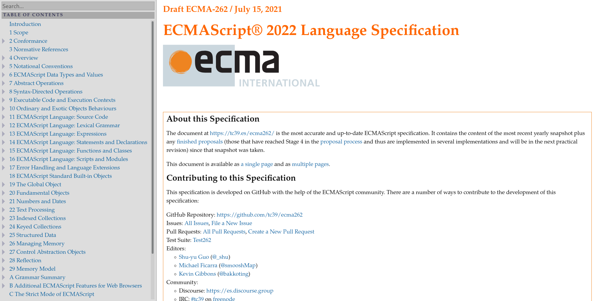
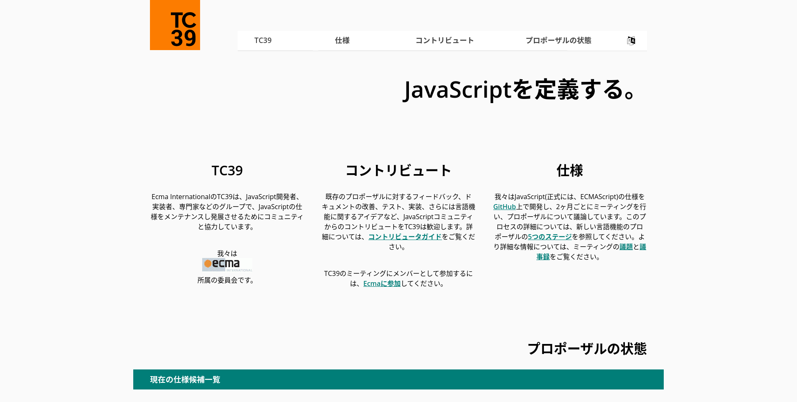
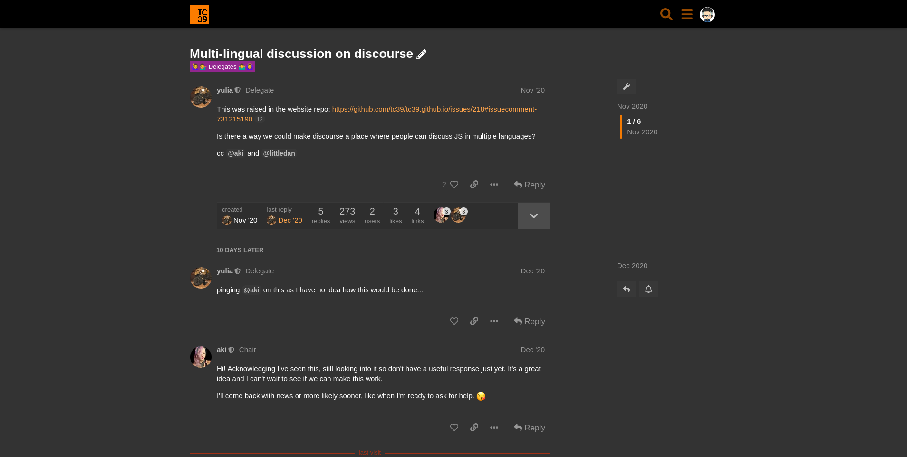
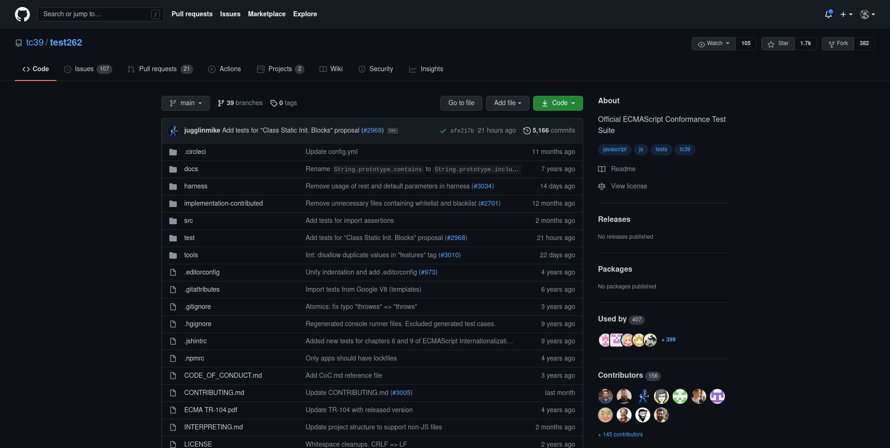
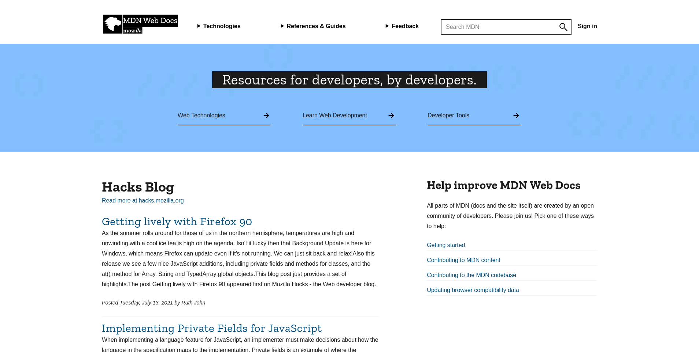
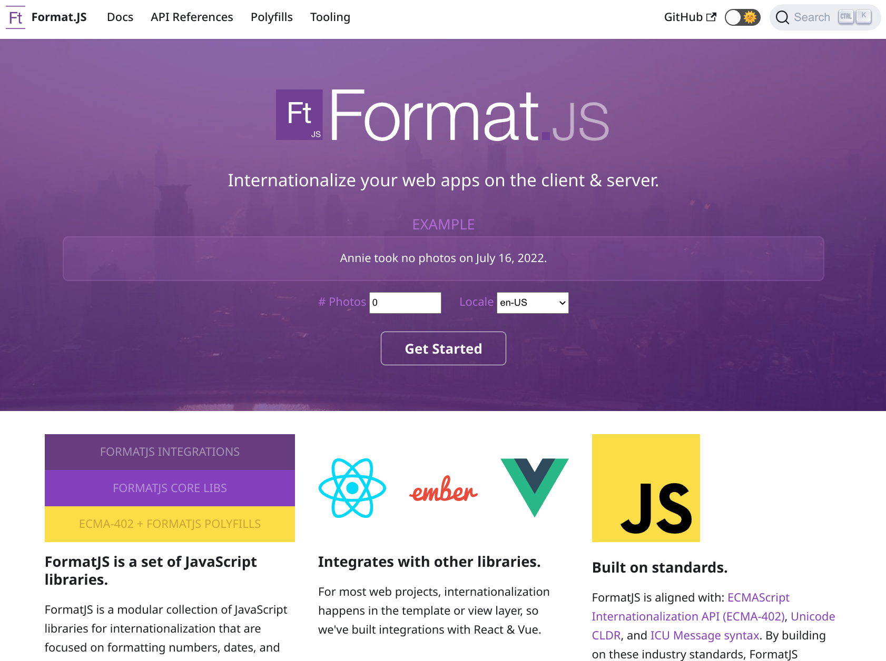

# TC39 on the Latest in ECMAScript Standards

## Shane F. Carr (@_sffc)
## July 2022, San Francisco

----

## TC39 Code of Conduct

https://tc39.es/code-of-conduct/

* Be **respectful**
* Be **friendly** and **patient**
* Be **inclusive**
* Be **considerate**
* Be careful in the **words that you choose**
* When we disagree, **try to understand why**

----

## COVID-19 Policy

* Please be **considerate** of each other's health tolerance and wear a face mask.

* In the reception space between Batgirl and Sue Storm, you may remove your mask briefly while eating/drinking.

----

## Special Thanks

- To Dave Nugent and The SF JavaScript Meetup for partnering with TC39 for this event
- To Ujjwal Sharma (@ryzokuken) for contributing to these slides

----

## Agenda

* What is TC39?
* Proposal Deep Dives
* TC39 Delegates Panel and Q&A

---

----

----

----

## About TC39 🔍

* ECMA Technical Committee
* ECMAScript Language and Standard API
  * ECMA-262 (JavaScript)
  * ECMA-402 (Internationalization) 👋
  * ECMA-404 (JSON)
* Different sub-groups
  * TC39-TG2 (Internationalization) 👋
  * TC39-TG3 (Security)
  * Inclusion ad-hoc group

----

----

## Who? 👨‍🔧

* Delegates
  * Implementers
  * Large websites
  * Academics
  * OpenJS Foundation
* Invited Experts
  * Subject matter exports
  * Community representatives
* Contributors
* Community

---

## How We Work

* No voting
* Consensus-based decision making
  * Diverse set of people in the committee
  * Work to satisfy everyone’s needs and goals
  * Objections and concerns
  * Backing rationales
* No stakeholder kept over another
* Don’t standardize things which aren’t ready
* 6 plenaries per year (including this week)

----

## Stage Process 🗃

https://tc39.es/process-document/

* Stage 0
  * Just an idea
* Stage 1
  * Describe shape of solution
  * Identify potential blockers

----

## Stage Process 🗃

* Stage 2
  * Describe precise syntactic and semantic details
* Stage 3
  * Further feedback from implementations and users
* Stage 4
  * Tested and ready for addition to the standard

----

## Example Proposals

* Stage 1: Decimal 🔢
	* Committee exploring problem space
* Stage 2: Records and Tuples 📂
	* Specification being finalized
* Stage 3: Temporal ⌚
	* Implementations in Progress
* Stage 4: Top-Level Await ⏳
	* Widely Available to Developers

---

## Official communication channels 💬

* GitHub
* Matrix
* Discourse
* Incubator Calls
* Website

----

----

----

## TC39 Outreach Groups 📣

* TC39 Outreach to important focus groups
* Tools and Transpilers
* Frameworks
* Educators
  * Work on educational material
* Monthly calls
* Discuss ongoing TC39 proposals

----

## How do I get involved? 👩‍🏭

* Issue trackers of any relevant proposals
* Contribute to documentation on MDN
* Write polyfills for Stage 3 proposals
* Discourse to discuss new proposals
* File issues, create pull requests and write tests
* Your employer can become a member
* Join as an invited expert if you care about a specific topic

----

----

----

---

# Proposal Deep Dives
