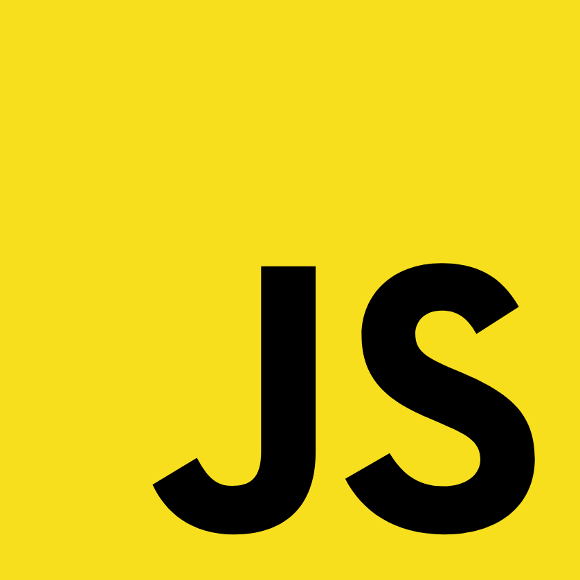
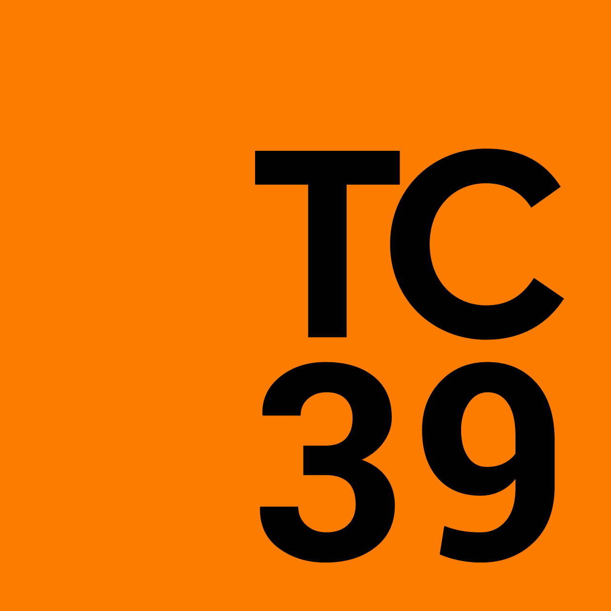
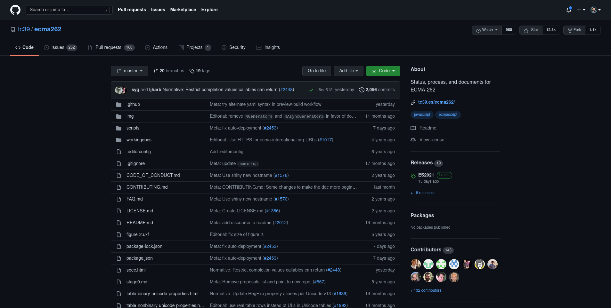
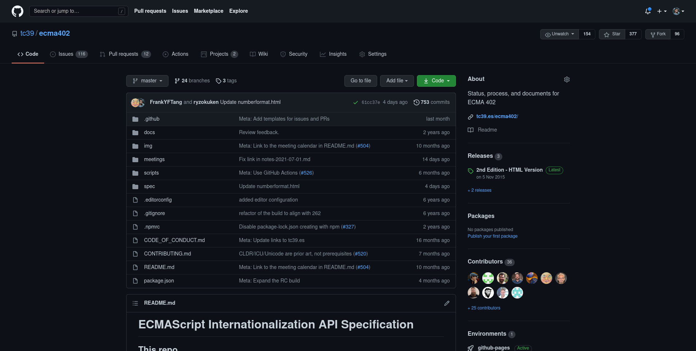
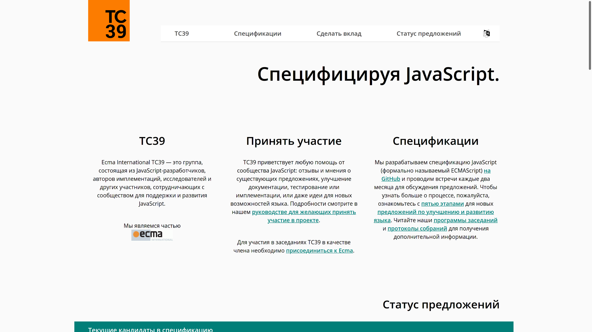
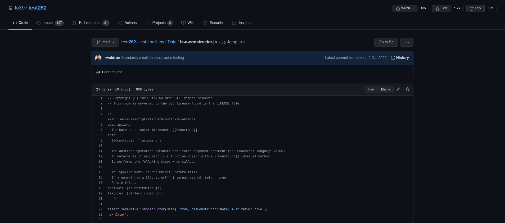

## TC39 Demystified 🔭

### Ujjwal Sharma (@ryzokuken)

### September 2023, CityJS New Delhi 🇮🇳

---

## About Me 👨

<div style="display: grid; grid-auto-flow: column">


-   Ujjwal "Ryzokuken" Sharma
-   Compilers Hacker at Igalia
-   TC39 Delegate
-   ECMA-402 Editor
-   Node.js Core Collaborator
-   V8 Contributor
-   International Speaker

</div>

----

## About Igalia 💻

-   Software Consultancy
-   HQ in Galicia, Spain 🇪🇸
-   Free Software
-   TC39, W3C
-   Web Browsers
-   Compilers
-   Web Standards

----



----


----



----

## About TC39 🔍

-   ECMA Technical Committee
-   ECMAScript Language and Standard API
    -   ECMA-262 (JavaScript)
    -   ECMA-402 (Internationalization)
    -   ECMA-404 (JSON)
-   Different sub-groups
    -   TC39-TG2 (Internationalization)
    -   TC39-TG3 (Security)
    -   Inclusion ad-hoc group
        <!-- * Members -->
        <!--   * Browsers (Google) -->
        <!--   * Runtimes (Oracle) -->
        <!--   * Tooling (Babel) -->
        <!--   * Derivatives/Transpilers (TypeScript) -->
        <!--   * Large websites (Salesforce) -->
        <!--   * Academics -->
        <!--   * Frameworks and libraries -->

---

## Who? 👨‍🔧

-   Delegates
    -   Implementers (Google, Apple, Mozilla)
    -   Large websites (Bloomberg, PayPal)
    -   Academics
    -   OpenJS Foundation
-   Invited Experts
    -   Subject matter experts
    -   Community representatives
-   Contributors
-   Community

---

## Where 🧭

----



----



---

## What? ⚙

-   Pull request to the standard GitHub repository
-   Meta and Markup changes
-   Editorial Changes
    -   Editor Group
-   Normative Changes
-   Proposals
    -   Authors and Champions
    -   Stage Process
    -   Reviewers
    -   Consensus

---

## When? ⌚

-   Quarterly meetings
    -   4-day
    -   in-person
-   Light meetings in between
    -   2-day
    -   online
-   Monthly ECMA-402 meeting
-   Smaller, more focussed meetings
-   Incubator calls
-   GitHub
-   Discourse

---

## How? 🤔

-   No voting
-   Consensus-based decision making
    -   Diverse set of people in the committee
    -   Work to satisfy everyone’s needs and goals
    -   Objections and concerns
    -   Backing rationales
-   No stakeholder kept over another
-   Don’t standardize things which aren’t ready

---

## Stage Process 🗃

-   Stage 0: Strawperson
    -   Just an idea
-   Stage 1: Proposal
    -   Describe shape of solution
    -   Identify potential blockers

----

## Stage Process 🗃

-   Stage 2: Draft
    -   Describe precise syntactic and semantic details
-   Stage 3: Candidate
    -   Further feedback from implementations and users
-   Stage 4: Finished
    -   Tested and ready for addition to the standard

---

## Building Consensus 💆

-   Authors develop the proposal with stakeholder input
-   Champions may act as a bridge between authors and TC39
-   Any aspects may be discussed, feedback may be given openly
-   Concerns raised early and asynchronously

----

## Building Consensus 💆

-   Consensus is given as an indicator of the current stage
-   A delegate may pose a constraint as necessary for advancement
-   Many constraints with rationales, committee may make a trade-off
-   Stage 3 consensus implies completeness and any design concerns should be raised before Stage 3

---

# A deeper look into the stage process 🔬

---

## Stage 3: Temporal ⏳

-   Many many problems with the legacy `Date` object
-   Libraries try to easy the pain, with different levels of effectiveness
-   Various stakeholders come together and decide to fix this
-   Long discussion process to go through semantic details
-   Champions group reached consensus on API details
-   Diverse group of stakeholders invested
-   Reached Stage 3 in early 2021, implementations ongoing

----

## Stage 3: Temporal ⏳

```javascript
function* calculateDailyOccurrence(sd, pt, tz) {
    for (let date = sd; ; date = date.add({ days: 1 })) {
        yield date.toZonedDateTime({ pt, tz }).toInstant()
    }
}

const sd = Temporal.PlainDate.from("2017-03-10")
const time = Temporal.PlainTime.from("08:00")
const tz = Temporal.TimeZone.from("America/Los_Angeles")
const iter = calculateDailyOccurrence(sd, time, tz)

assert.equal(iter.next().value.toString(), "2017-03-10T16:00:00Z")
assert.equal(iter.next().value.toString(), "2017-03-11T16:00:00Z")
// DST change:
assert.equal(iter.next().value.toString(), "2017-03-12T15:00:00Z")
assert.equal(iter.next().value.toString(), "2017-03-13T15:00:00Z")
```

---

## Stage 2: Records and Tuples 📂

-   New collection data types
-   Immutable versions of plain objects and arrays
-   Adds compound types that are compared by value
-   Allows compound types to be used in `Set` and `Map`...
-   `JSON.parseImmutable`
-   Literal syntax supported via a babel plugin

----

## Stage 2: Records and Tuples 📂

```javascript
const map = new Set([#{ x: 0, y: 0 }, #[1, 1]])

console.log(map.has(#{ x: 0, y: 0 })) // true
console.log(map.has(#{ x: 1, y: 1 })) // false
console.log(map.has(#[0, 0])) // false
console.log(map.has(#[1, 1])) // true
```

---

## Stage 1: Decimal 🔢

-   Number is an IEEE 754 64-bit float
-   Base 2 fractions can't represent .1 or .2 properly
-   ⅓ in base 10: closest we can get is .3333333…
-   Three data models:
    -   Fraction
    -   BigDecimal
    -   Decimal128
-   BigDecimal has problems: What should 1m/3m be?
-   What about both?

----

## Stage 1: Decimal 🔢

```javascript
function calculateBill(items, tax) {
    let total = 0m
    for (let { price, count } of items) {
        total += price * BigDecimal(count)
    }
    return BigDecimal.round(total * (1m + tax), {
        maximumFractionDigits: 2,
        round: "up",
    })
}

let items = [
    { price: 1.25m, count: 5 },
    { price: 5m, count: 1 },
]
let tax = 0.0735m
console.log(calculateBill(items, tax))
```

---

## Official communication channels 💬

-   GitHub
-   Matrix
-   Discourse
-   Incubator Calls
-   Website

----



----


----

## TC39 Outreach Groups 📣

-   TC39 Outreach to important focus groups
-   Tools and Transpilers
-   Frameworks
-   Educators
    -   Work on educational material
-   Monthly calls
-   Discuss ongoing TC39 proposals

---

## How do I get involved? 👩‍🏭

-   Issue trackers of any relevant proposals
-   Contribute to documentation on MDN
-   Discourse to discuss new proposals
-   File issues, create pull requests and write tests
-   Your employer can become a member
-   Join as an invited expert if you care about a specific topic

----


----



----


----


---

# धन्यवाद! 🙏
